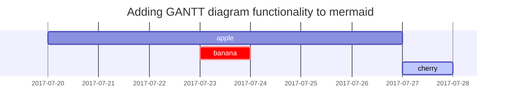

Este post tem como objetivo mostrar a renderização da sintaxe Markdown no [**Chirpy**](https://github.com/cotes2020/jekyll-theme-chirpy/fork), você também pode usá-lo como um exemplo de escrita. Agora, vamos começar a explorar texto e tipografia.

## Títulos

# H1 - título
{: .mt-4 .mb-0 }

## H2 - título
{: data-toc-skip='' .mt-4 .mb-0 }

### H3 - título
{: data-toc-skip='' .mt-4 .mb-0 }

#### H4 - título
{: data-toc-skip='' .mt-4 }

## Parágrafo

Quisque egestas convallis ipsum, ut sollicitudin risus tincidunt a. Maecenas interdum malesuada egestas. Duis consectetur porta risus, sit amet vulputate urna facilisis ac. Phasellus semper dui non purus ultrices sodales. Aliquam ante lorem, ornare a feugiat ac, finibus nec mauris. Vivamus ut tristique nisi. Sed vel leo vulputate, efficitur risus non, posuere mi. Nullam tincidunt bibendum rutrum. Proin commodo ornare sapien. Vivamus interdum diam sed sapien blandit, sit amet aliquam risus mattis. Nullam arcu turpis, mollis quis laoreet at, placerat id nibh. Suspendisse venenatis eros eros.

## Listas

### Lista ordenada

1. Em primeiro lugar
2. Em segundo lugar
3. Em terceiro lugar

### Lista não ordenada

- Capítulo
  + Seção
    * Parágrafo

### Lista de Tarefas

- [ ] Trabalho
  + [x] Passo 1
  + [x] Passo 2
  + [ ] Passo 3

### Lista de Descrição

Sol
: a estrela ao redor da qual a Terra orbita

Lua
: o satélite natural da Terra, visível pela luz refletida do sol

## Citação em Bloco

> Esta linha mostra a _citação em bloco_.

## Comandos

> Um exemplo mostrando o comando do tipo `dica`.
{: .prompt-tip }

> Um exemplo mostrando o comando do tipo `informação`.
{: .prompt-info }

> Um exemplo mostrando o comando do tipo `aviso`.
{: .prompt-warning }

> Um exemplo mostrando o comando do tipo `perigo`.
{: .prompt-danger }

## Tabelas

| Empresa                      | Contato          | País     |
|:-----------------------------|:-----------------|--------:|
| Alfreds Futterkiste          | Maria Anders     | Alemanha|
| Island Trading               | Helen Bennett    | Reino Unido |
| Magazzini Alimentari Riuniti | Giovanni Rovelli | Itália  |

## Links

<http://127.0.0.1:4000>

## Nota de Rodapé

Clicar no gancho localizará a nota de rodapé[^footnote], e aqui está outra nota de rodapé[^fn-nth-2].

## Código Inline

Este é um exemplo de `Código Inline`.

## Caminho do Arquivo

Aqui está o `/caminho/para/o/arquivo.extensão`{: .filepath}.

## Blocos de Código

### Comum

```
Este é um trecho de código comum, sem destaque de sintaxe e número de linha.
```

### Linguagem Específica

```bash
if [ $? -ne 0 ]; then
  echo "O comando não foi bem-sucedido.";
  #faça o necessário / saia
fi;
```

### Nome de Arquivo Específico

```sass
@import
  "cores/tipografia-clara",
  "cores/tipografia-escura";
```
{: arquivo='_sass/jekyll-theme-chirpy.scss'}

## Matemática

A matemática é alimentada pelo [**MathJax**](https://www.mathjax.org/):

$$ \sum_{n=1}^\infty 1/n^2 = \frac{\pi^2}{6} $$

Quando $a \neq 0$, existem duas soluções para $ax^2 + bx + c = 0$ e são

$$ x = {-b \pm \sqrt{b^2-4ac} \over 2a} $$

## Gráfico Mermaid SVG

```mermaid
 gantt
  title  Adição da funcionalidade do diagrama GANTT ao mermaid
  apple :a, 2017-07-20, 1w
  banana :crit, b, 2017-07-23, 1d
  cherry :active, c, após b a, 1d
```

## Imagens

### Padrão (com legenda)

{: width="972" height="589" }
_Largura de tela inteira e alinhamento central_

### Alinhado à esquerda

{: width="972" height="589" .w-75 .normal}

### Flutuar à esquerda

{: width="972" height="589" .w-50 .left}
Praesent maximus aliquam sapien. Sed vel neque in dolor pulvinar auctor. Maecenas pharetra, sem sit amet interdum posuere, tellus lacus eleifend magna, ac lobortis felis ipsum id sapien. Proin ornare rutrum metus, ac convallis diam volutpat sit amet. Phasellus volutpat, elit sit amet tincidunt mollis, felis mi scelerisque mauris, ut facilisis leo magna accumsan sapien. In rutrum vehicula nisl eget tempor. Nullam maximus ullamcorper libero non maximus. Integer ultricies velit id convallis varius. Praesent eu nisl eu urna finibus ultrices id nec ex. Mauris ac mattis quam. Fusce aliquam est nec sapien bibendum, vitae malesuada ligula condimentum.

### Flutuar à direita

{: width="972" height="589" .w-50 .right}
Praesent maximus aliquam sapien. Sed vel neque in dolor pulvinar auctor. Maecenas pharetra, sem sit amet interdum posuere, tellus lac


# ENGLISH 👇

This post is to show Markdown syntax rendering on [**Chirpy**](https://github.com/cotes2020/jekyll-theme-chirpy/fork), you can also use it as an example of writing. Now, let's start looking at text and typography.

## Headings

# H1 - heading
{: .mt-4 .mb-0 }

## H2 - heading
{: data-toc-skip='' .mt-4 .mb-0 }

### H3 - heading
{: data-toc-skip='' .mt-4 .mb-0 }

#### H4 - heading
{: data-toc-skip='' .mt-4 }

## Paragraph

Quisque egestas convallis ipsum, ut sollicitudin risus tincidunt a. Maecenas interdum malesuada egestas. Duis consectetur porta risus, sit amet vulputate urna facilisis ac. Phasellus semper dui non purus ultrices sodales. Aliquam ante lorem, ornare a feugiat ac, finibus nec mauris. Vivamus ut tristique nisi. Sed vel leo vulputate, efficitur risus non, posuere mi. Nullam tincidunt bibendum rutrum. Proin commodo ornare sapien. Vivamus interdum diam sed sapien blandit, sit amet aliquam risus mattis. Nullam arcu turpis, mollis quis laoreet at, placerat id nibh. Suspendisse venenatis eros eros.

## Lists

### Ordered list

1. Firstly
2. Secondly
3. Thirdly

### Unordered list

- Chapter
  + Section
    * Paragraph

### ToDo list

- [ ] Job
  + [x] Step 1
  + [x] Step 2
  + [ ] Step 3

### Description list

Sun
: the star around which the earth orbits

Moon
: the natural satellite of the earth, visible by reflected light from the sun

## Block Quote

> This line shows the _block quote_.

## Prompts

> An example showing the `tip` type prompt.
{: .prompt-tip }

> An example showing the `info` type prompt.
{: .prompt-info }

> An example showing the `warning` type prompt.
{: .prompt-warning }

> An example showing the `danger` type prompt.
{: .prompt-danger }

## Tables

| Company                      | Contact          | Country |
|:-----------------------------|:-----------------|--------:|
| Alfreds Futterkiste          | Maria Anders     | Germany |
| Island Trading               | Helen Bennett    | UK      |
| Magazzini Alimentari Riuniti | Giovanni Rovelli | Italy   |

## Links

<http://127.0.0.1:4000>

## Footnote

Click the hook will locate the footnote[^footnote], and here is another footnote[^fn-nth-2].

## Inline code

This is an example of `Inline Code`.

## Filepath

Here is the `/path/to/the/file.extend`{: .filepath}.

## Code blocks

### Common

```
This is a common code snippet, without syntax highlight and line number.
```

### Specific Language

```bash
if [ $? -ne 0 ]; then
  echo "The command was not successful.";
  #do the needful / exit
fi;
```

### Specific filename

```sass
@import
  "colors/light-typography",
  "colors/dark-typography";
```
{: file='_sass/jekyll-theme-chirpy.scss'}

## Mathematics

The mathematics powered by [**MathJax**](https://www.mathjax.org/):

$$ \sum_{n=1}^\infty 1/n^2 = \frac{\pi^2}{6} $$

When $a \ne 0$, there are two solutions to $ax^2 + bx + c = 0$ and they are

$$ x = {-b \pm \sqrt{b^2-4ac} \over 2a} $$

## Mermaid SVG



## Images

### Default (with caption)

{: width="972" height="589" }
_Full screen width and center alignment_

### Left aligned

{: width="972" height="589" .w-75 .normal}

### Float to left

{: width="972" height="589" .w-50 .left}
Praesent maximus aliquam sapien. Sed vel neque in dolor pulvinar auctor. Maecenas pharetra, sem sit amet interdum posuere, tellus lacus eleifend magna, ac lobortis felis ipsum id sapien. Proin ornare rutrum metus, ac convallis diam volutpat sit amet. Phasellus volutpat, elit sit amet tincidunt mollis, felis mi scelerisque mauris, ut facilisis leo magna accumsan sapien. In rutrum vehicula nisl eget tempor. Nullam maximus ullamcorper libero non maximus. Integer ultricies velit id convallis varius. Praesent eu nisl eu urna finibus ultrices id nec ex. Mauris ac mattis quam. Fusce aliquam est nec sapien bibendum, vitae malesuada ligula condimentum.

### Float to right

{: width="972" height="589" .w-50 .right}
Praesent maximus aliquam sapien. Sed vel neque in dolor pulvinar auctor. Maecenas pharetra, sem sit amet interdum posuere, tellus lacus eleifend magna, ac lobortis felis ipsum id sapien. Proin ornare rutrum metus, ac convallis diam volutpat sit amet. Phasellus volutpat, elit sit amet tincidunt mollis, felis mi scelerisque mauris, ut facilisis leo magna accumsan sapien. In rutrum vehicula nisl eget tempor. Nullam maximus ullamcorper libero non maximus. Integer ultricies velit id convallis varius. Praesent eu nisl eu urna finibus ultrices id nec ex. Mauris ac mattis quam. Fusce aliquam est nec sapien bibendum, vitae malesuada ligula condimentum.

### Dark/Light mode & Shadow

The image below will toggle dark/light mode based on theme preference, notice it has shadows.

{: .light .w-75 .shadow .rounded-10 w='1212' h='668' }
{: .dark .w-75 .shadow .rounded-10 w='1212' h='668' }

## Video



## Reverse Footnote

[^footnote]: The footnote source
[^fn-nth-2]: The 2nd footnote source
